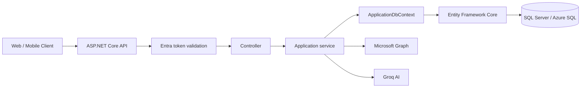
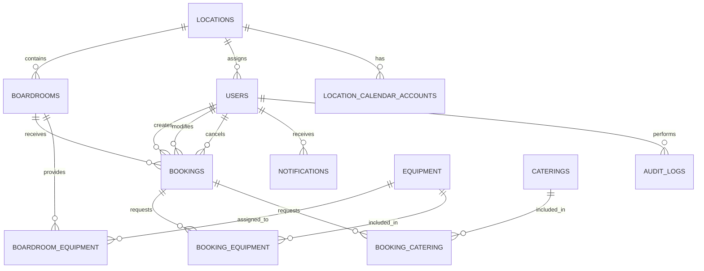
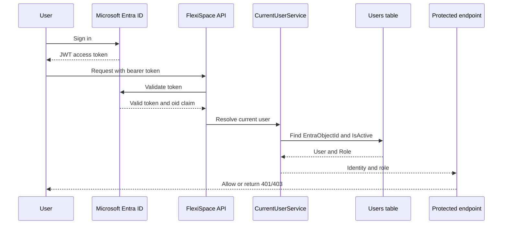
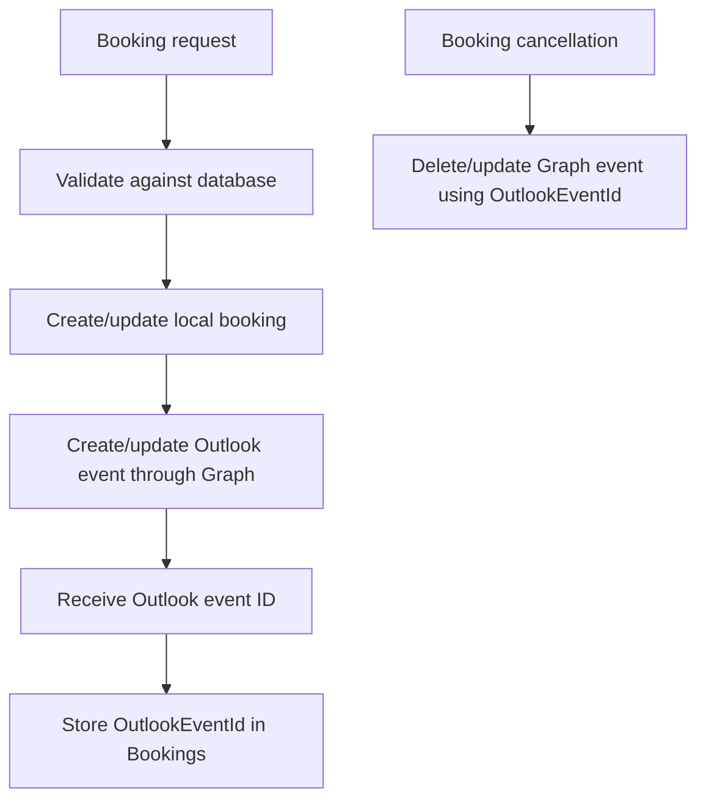
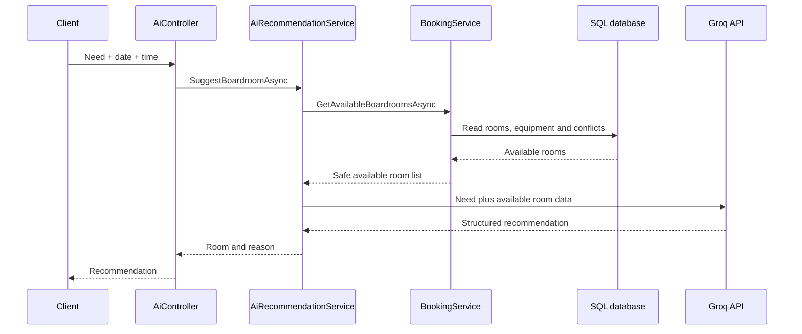
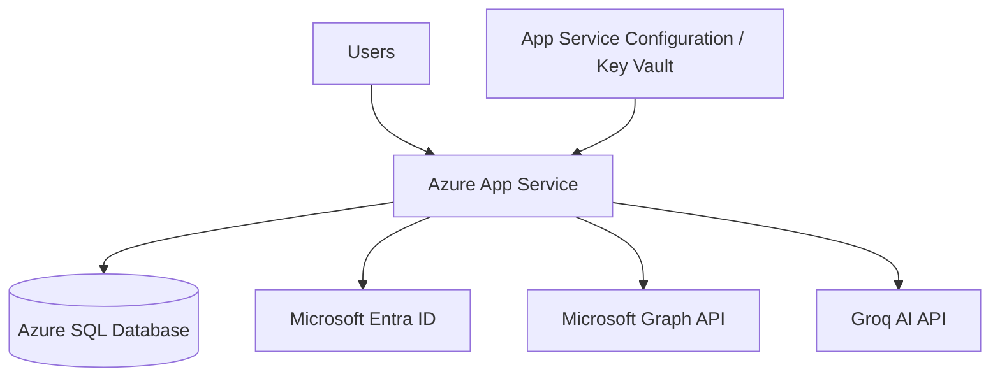

# FlexiSpace Database & Backend Handover

> **Repository:** [Maluleke-Khensani/FlexiSpace-Boardroom-Booking-System](https://github.com/Maluleke-Khensani/FlexiSpace-Boardroom-Booking-System)  
> **Scope:** Backend, database, authentication, authorization, calendar integration, CRUD APIs and AI room recommendations  
> **Target hosting:** Azure App Service + Azure SQL Database

## 1. Purpose

This document explains how the FlexiSpace backend works, where the database is used, how the tables relate to one another, how requests flow through the application, and what must change before deployment to Azure.

The backend is implemented in the `FlexiSpace` solution using .NET 8, ASP.NET Core Web API, Entity Framework Core and SQL Server.

## 2. Backend stack

| Area | Implementation |
|---|---|
| API | ASP.NET Core Web API (.NET 8) |
| Database | Microsoft SQL Server / Azure SQL |
| ORM | Entity Framework Core 8 |
| Authentication | Microsoft Entra ID bearer tokens |
| Authorization | Database-backed roles in `Users.Role` |
| Calendar | Microsoft Graph API |
| AI recommendations | Groq API via `AiRecommendationService` |
| Schema management | EF Core migrations |
| API documentation | Swagger in development |

## 3. Repository areas related to the database

```text
FlexiSpace/
├── FlexiSpace.API/
│   ├── Program.cs                         Database and service registration
│   ├── Controllers/                       API endpoints
│   └── Authorization/                     Role authorization filter
├── FlexiSpace.Core/
│   ├── Entities/                          Database entities
│   ├── DTOs/                              API request/response models
│   ├── Enums/                             Roles and statuses
│   └── Services/                          Service contracts/interfaces
├── FlexiSpace.Infrastructure/
│   ├── Persistence/
│   │   ├── ApplicationDbContext.cs        EF Core database context
│   │   └── Configurations/                Fluent API mappings
│   ├── Migrations/                        Database schema history
│   ├── Seed/                              Development seed data
│   └── services/                          Database-backed services
└── FlexiSpace.Tests/                      Backend service tests
```

## 4. Overall application flow



1. A client sends an HTTP request with a bearer token.
2. ASP.NET Core validates the token through Microsoft Entra ID.
3. The request reaches a controller.
4. The controller calls an application service.
5. The service uses `ApplicationDbContext` to query or update SQL Server.
6. Booking operations can also call Microsoft Graph.
7. The controller maps entities to DTOs and returns the response.

## 5. Database context

The central database class is [`ApplicationDbContext.cs`](https://github.com/Maluleke-Khensani/FlexiSpace-Boardroom-Booking-System/blob/master/FlexiSpace/FlexiSpace.Infrastructure/Persistence/ApplicationDbContext.cs).

It exposes these tables:

| `DbSet` | Table | Purpose |
|---|---|---|
| `Locations` | `Locations` | FlexiSpace branches |
| `Boardrooms` | `Boardrooms` | Bookable rooms |
| `Users` | `Users` | Local users linked to Entra ID |
| `Bookings` | `Bookings` | Room reservations |
| `Equipments` | `Equipment` | Equipment catalogue |
| `Caterings` | `Caterings` | Catering catalogue |
| `BoardroomEquipments` | `BoardroomEquipment` | Boardroom/equipment junction |
| `BookingEquipments` | `BookingEquipment` | Booking/equipment junction |
| `BookingCaterings` | `BookingCatering` | Booking/catering junction |
| `LocationCalendarAccounts` | `LocationCalendarAccounts` | Outlook calendars per location |
| `Notifications` | `Notifications` | User notification inbox |
| `AuditLogs` | `AuditLogs` | Audit history |

`OnModelCreating` calls `ApplyConfigurationsFromAssembly`, automatically applying the Fluent API configuration classes. The context also sets booking timestamps: new records receive `CreatedAt`, and modified records receive `ModifiedAt`.

## 6. Entity relationship diagram



## 7. Tables and relationships

### `Locations`

A location represents a branch such as Centurion, Houghton or Eagle Canyon.

| Field | Meaning |
|---|---|
| `Id` | Primary key |
| `Name` | Location name |
| `Address` | Physical address |

One location can have many boardrooms, users and calendar accounts.

### `Boardrooms`

A boardroom is a bookable meeting room.

| Field | Meaning |
|---|---|
| `Id` | Primary key |
| `Name` | Room name |
| `Capacity` | Maximum attendees |
| `Status` | Room status enum |
| `IsActive` | Whether the room is active |
| `LocationId` | Foreign key to `Locations` |
| `CreatedAt` | Creation timestamp |

`BoardroomService` loads rooms together with their locations and equipment. When a room is updated, existing equipment links are removed and the new links are added.

### `Users`

The `Users` table links Microsoft Entra identities to FlexiSpace application accounts.

| Field | Meaning |
|---|---|
| `Id` | Internal primary key |
| `EntraObjectId` | Entra user's object ID |
| `FirstName` | First name |
| `LastName` | Surname |
| `Email` | Email address |
| `Role` | FlexiSpace role |
| `IsActive` | Local account status |
| `LocationId` | Optional location assignment |
| `CreatedAt` | Creation timestamp |

Unique indexes exist on `Email` and `EntraObjectId`. `LocationId` is optional because external clients may not belong to a branch.

### `Bookings`

This is the main transaction table.

| Field | Meaning |
|---|---|
| `Id` | Primary key |
| `BoardroomId` | Room being booked |
| `UserId` | User who created the booking |
| `BookingDate` | Booking date |
| `StartTime` / `EndTime` | Booking period |
| `Status` | Booking status |
| `Company` | Optional company |
| `NumberOfAttendees` | Number of attendees |
| `Notes` | Additional details |
| `OutlookEventId` | Microsoft Graph event ID |
| `CreatedAt` | Creation timestamp |
| `ModifiedAt` | Last modification timestamp |
| `ModifiedById` | User who modified it |
| `CancelledById` | User who cancelled it |

A booking belongs to one user and one boardroom. It can contain equipment and catering lines.

### `Equipment` and `Caterings`

These are catalogue tables managed through CRUD services. Equipment may include projectors, whiteboards and video-conferencing systems. Catering may include tea, coffee and sandwiches.

### Junction tables

- `BoardroomEquipment` links rooms to the equipment they provide.
- `BookingEquipment` links bookings to requested equipment and stores `Quantity`.
- `BookingCatering` links bookings to requested catering and stores `Quantity`.

Composite keys are used for each junction table:

```text
BoardroomId + EquipmentId
BookingId + EquipmentId
BookingId + CateringId
```

### `LocationCalendarAccounts`

Stores Outlook calendar mailboxes associated with a location.

| Field | Meaning |
|---|---|
| `Id` | Primary key |
| `Email` | Calendar mailbox |
| `DisplayName` | Friendly name |
| `IsPrimary` | Default calendar flag |
| `IsActive` | Whether it can be used |
| `LocationId` | Foreign key to `Locations` |
| `CreatedAt` | Creation timestamp |

### `Notifications`

Notifications belong to users and are system-managed. Users can retrieve their own notifications, retrieve unread counts, mark one notification as read, or mark all as read.

### `AuditLogs`

Audit records store the acting user, action, affected entity and old/new values. Old and new values are stored as JSON strings, allowing administrators to see what changed.

## 8. Authentication and authorization



### Authentication

Microsoft Entra ID authenticates the user and issues the bearer token.

### Authorization

The application uses the Entra object ID from the token to find the local user. It then checks:

1. `Users.EntraObjectId`
2. `Users.IsActive`
3. `Users.Role`

`AuthorizeRolesAttribute` uses that local role to protect endpoints. This means authentication and authorization are separate:

```text
Authentication: Is the user authenticated by Entra ID?
Authorization: What may this user do in FlexiSpace?
```

The administrator user controller is protected with:

```csharp
[Authorize]
[AuthorizeRoles(UserRole.Administrator)]
```

## 9. Where the database is used

### Database registration

`Program.cs` registers the SQL Server provider:

```csharp
builder.Services.AddDbContext<ApplicationDbContext>(options =>
    options.UseSqlServer(
        builder.Configuration.GetConnectionString("DefaultConnection")));
```

Database-dependent services registered in `Program.cs` include:

- `ILocationService`
- `IBoardroomService`
- `IEquipmentService`
- `IBookingService`
- `ICateringService`
- `IUserService`
- `ICurrentUserService`
- `IAuditService`
- `INotificationService`

### Location operations

The location service uses `Locations` to list, retrieve, create, update and delete locations where foreign-key restrictions allow it.

### Boardroom operations

The boardroom service uses `Boardrooms`, `Locations`, `BoardroomEquipment` and `Equipment` to:

- Retrieve rooms with their locations
- Retrieve equipment assigned to rooms
- Create rooms
- Update room details
- Replace equipment assignments
- Delete rooms where allowed

### Booking operations

`BookingController` exposes:

| Method | Endpoint | Purpose |
|---|---|---|
| `GET` | `/api/Booking` | List bookings |
| `GET` | `/api/Booking/search` | Filter, sort and paginate bookings |
| `GET` | `/api/Booking/{id}` | Retrieve one booking |
| `POST` | `/api/Booking` | Create a booking |
| `PUT` | `/api/Booking/{id}` | Update a booking |
| `DELETE` | `/api/Booking/{id}` | Cancel/delete according to service rules |
| `PATCH` | `/api/Booking/{id}/status` | Change booking status |

Creating a booking creates the main `Booking` entity and related `BookingEquipment` and `BookingCatering` rows. The service validates the user, room, capacity, status, time range, equipment, catering and conflicts.

### Availability and conflict detection

A requested booking overlaps an existing booking when:

```text
RequestedStart < ExistingEnd
AND
ExistingStart < RequestedEnd
```

```text
Existing:  10:00 -------- 11:00
Request A:       10:30 -------- 11:30   CONFLICT
Request B:                    11:00 -------- 12:00   NO OVERLAP
```

The availability query reads active boardrooms and removes rooms that have slot-holding bookings during the requested period.

### User administration

`UserController` is administrator-only. It uses the database to:

- List provisioned users
- Retrieve one user
- Provision an existing Entra user locally
- Change name, role or location
- Activate/deactivate a local FlexiSpace account
- Write administrator actions to `AuditLogs`

Provisioning does not create an Entra account. It adds an existing Entra user to the local application database.

### Notifications

`NotificationService` creates notifications, retrieves a user's notifications, counts unread rows, and marks notifications as read. Queries are scoped to the current local user ID.

### Audit logging

`AuditService` writes administrative changes to `AuditLogs`, including user provisioning, profile updates and status changes.

## 10. Microsoft Graph calendar integration



The database does not copy the complete Outlook calendar. It stores the external event reference in `Bookings.OutlookEventId`.

The Graph service supports:

- Creating calendar events
- Updating calendar events
- Deleting calendar events

`LocationCalendarAccounts` stores the mailbox information used for a location.

## 11. AI room recommendation and database use

The AI endpoint is:

```text
POST /api/Ai/suggest
```

The AI does not independently decide availability. It first calls the database-backed availability method.



The database supplies:

- Available boardrooms
- Room capacity
- Room status
- Equipment assigned to rooms
- Existing bookings and conflicts

The AI is instructed to recommend only a room in the database-provided list. If no room is available, the external AI call is skipped.

## 12. Controller-service-database pattern

```text
Controller
    ↓ calls interface
Application service
    ↓ uses
ApplicationDbContext
    ↓ uses
Entity Framework Core
    ↓ executes SQL
SQL Server / Azure SQL
```

DTOs are used at the API boundary so database entities are not exposed directly to clients.

## 13. Fluent API configuration and delete behaviour

Database relationship rules are stored in:

```text
FlexiSpace/FlexiSpace.Infrastructure/Persistence/Configurations/
```

These files configure table names, required fields, string lengths, keys, indexes, foreign keys, enum conversions and delete behaviour.

### Cascade delete

Cascade delete is used for dependent rows such as:

```text
Booking -> BookingEquipment
Booking -> BookingCatering
User -> Notifications
```

### Restrict delete

Restrict delete protects historical data:

```text
Location -> Boardroom
Boardroom -> Booking
User -> Booking
Equipment -> BookingEquipment
Catering -> BookingCatering
```

For records with history, deactivation using `IsActive = false` is generally safer than physical deletion.

## 14. EF Core migrations

Migrations are in `FlexiSpace/FlexiSpace.Infrastructure/Migrations/`.

Current migration history:

```text
20260731103719_InitialCreate
20260731192644_MakeAuditLogValuesNullable
20260731193409_UseAuditActionEnum
20260915181243_AddBookingModifiedAndCancelledBy
20260917072130_MakeUserLocationOptional
```

Migrations are the history of the database schema. Keep them in the repository.

Apply migrations locally:

```powershell
dotnet ef database update `
  --project FlexiSpace/FlexiSpace.Infrastructure `
  --startup-project FlexiSpace/FlexiSpace.API
```

Generate a deployment script:

```powershell
dotnet ef migrations script `
  --project FlexiSpace/FlexiSpace.Infrastructure `
  --startup-project FlexiSpace/FlexiSpace.API `
  --output azure-sql-migration.sql
```

## 15. Local database configuration

The API expects `DefaultConnection`:

```json
{
  "ConnectionStrings": {
    "DefaultConnection": "Server=localhost;Database=FlexiSpaceDb;Trusted_Connection=True;TrustServerCertificate=True;MultipleActiveResultSets=true"
  }
}
```

Do not commit passwords or production connection strings. Use User Secrets locally:

```powershell
dotnet user-secrets set "ConnectionStrings:DefaultConnection" "YOUR_CONNECTION_STRING" --project FlexiSpace/FlexiSpace.API
```

## 16. Seed data and production cleanup

Development seed code is in `FlexiSpace/FlexiSpace.Infrastructure/Seed/DatabaseSeeder.cs`.

The current seeder creates sample users and uses `Guid.NewGuid()` for `EntraObjectId`. Those values are not real Microsoft Entra IDs.

Before production:

- Disable or remove the startup call to `SeedUsersAsync`.
- Remove fake/demo users from the production database.
- Provision real Entra users through the administrator workflow.
- Assign real roles in the local `Users` table.
- Keep migrations; remove only development data creation.

A safe development-only pattern is:

```csharp
if (app.Environment.IsDevelopment())
{
    using var scope = app.Services.CreateScope();
    var context = scope.ServiceProvider
        .GetRequiredService<ApplicationDbContext>();

    await DatabaseSeeder.SeedUsersAsync(context);
}
```

The Blazor web app (Flexispace.Web) and the MAUI app call the FlexiSpace API over HTTP. Do not treat leftover mock services as the live data store.

## 17. Azure hosting architecture



The SQL Server provider remains the same. The main change is that `DefaultConnection` points to Azure SQL instead of local SQL Server.

Configure these settings in Azure App Service or Key Vault:

```text
ConnectionStrings__DefaultConnection
AzureAd__Instance
AzureAd__TenantId
AzureAd__ClientId
AzureAd__ClientSecret
MicrosoftGraph__TenantId
MicrosoftGraph__ClientId
MicrosoftGraph__ClientSecret
Groq__ApiKey
```

Never commit these secrets to source control.

## 18. Azure deployment sequence

1. Create an Azure SQL Server.
2. Create the `FlexiSpaceDb` Azure SQL Database.
3. Configure the SQL firewall or private networking.
4. Configure App Service connection strings and settings.
5. Deploy the API.
6. Apply EF Core migrations.
7. Disable development seed execution.
8. Add real locations, boardrooms, equipment, catering and calendar accounts.
9. Provision the first real administrator.
10. Configure Entra redirect URLs and API permissions.
11. Approve required Graph permissions.
12. Test authentication, authorization, booking, calendar synchronization and AI recommendations.

## 19. Production checklist

### Database

- [ ] Azure SQL Database created
- [ ] `DefaultConnection` configured
- [ ] Azure SQL firewall/private networking configured
- [ ] EF Core migrations applied
- [ ] Backups and monitoring configured
- [ ] Reference data created
- [ ] Demo users and test bookings removed

### Security

- [ ] No SQL passwords in source code
- [ ] No Entra client secrets in source code
- [ ] No Graph secrets in source code
- [ ] No Groq API key in source code
- [ ] App Service settings or Key Vault configured
- [ ] HTTPS enabled

### Identity and roles

- [ ] Real Entra users provisioned
- [ ] Real `EntraObjectId` values stored
- [ ] Correct local roles assigned
- [ ] Inactive users rejected
- [ ] Administrator endpoints return `403` to non-administrators

### Calendar

- [ ] Location calendar accounts created
- [ ] Graph permissions approved
- [ ] Mailbox addresses verified
- [ ] Booking creation tested
- [ ] Booking update tested
- [ ] Booking cancellation tested
- [ ] South Africa Standard Time verified

## 20. Short handover explanation

I designed and implemented the backend database and API structure for FlexiSpace using ASP.NET Core, Entity Framework Core and SQL Server. The database contains locations, boardrooms, users, bookings, equipment, catering, junction tables, notifications, audit logs and Microsoft Graph calendar accounts. Users are linked to Microsoft Entra ID through `EntraObjectId`, while the local `Users.Role` field controls application permissions. Bookings are validated against the database for capacity, equipment, catering and time conflicts, then synchronized with Outlook through Microsoft Graph using `OutlookEventId`. The AI recommendation service also uses the database-backed availability check before recommending a room. EF Core migrations manage the schema, and Azure deployment requires moving the connection string to Azure SQL, disabling development seed data, and using real Entra and Graph configuration.

## 21. Source files

- [ApplicationDbContext.cs](https://github.com/Maluleke-Khensani/FlexiSpace-Boardroom-Booking-System/blob/master/FlexiSpace/FlexiSpace.Infrastructure/Persistence/ApplicationDbContext.cs)
- [Program.cs](https://github.com/Maluleke-Khensani/FlexiSpace-Boardroom-Booking-System/blob/master/FlexiSpace/FlexiSpace.API/Program.cs)
- [BookingController.cs](https://github.com/Maluleke-Khensani/FlexiSpace-Boardroom-Booking-System/blob/master/FlexiSpace/FlexiSpace.API/Controllers/BookingController.cs)
- [UserController.cs](https://github.com/Maluleke-Khensani/FlexiSpace-Boardroom-Booking-System/blob/master/FlexiSpace/FlexiSpace.API/Controllers/UserController.cs)
- [AiController.cs](https://github.com/Maluleke-Khensani/FlexiSpace-Boardroom-Booking-System/blob/master/FlexiSpace/FlexiSpace.API/Controllers/AiController.cs)
- [MicrosoftGraphCalendarService.cs](https://github.com/Maluleke-Khensani/FlexiSpace-Boardroom-Booking-System/blob/master/FlexiSpace/FlexiSpace.Infrastructure/services/MicrosoftGraphCalendarService.cs)
- [AiRecommendationService.cs](https://github.com/Maluleke-Khensani/FlexiSpace-Boardroom-Booking-System/blob/master/FlexiSpace/FlexiSpace.Infrastructure/services/AiRecommendationService.cs)
- [DatabaseSeeder.cs](https://github.com/Maluleke-Khensani/FlexiSpace-Boardroom-Booking-System/blob/master/FlexiSpace/FlexiSpace.Infrastructure/Seed/DatabaseSeeder.cs)
- [Migrations](https://github.com/Maluleke-Khensani/FlexiSpace-Boardroom-Booking-System/tree/master/FlexiSpace/FlexiSpace.Infrastructure/Migrations)
- [Persistence configurations](https://github.com/Maluleke-Khensani/FlexiSpace-Boardroom-Booking-System/tree/master/FlexiSpace/FlexiSpace.Infrastructure/Persistence/Configurations)
